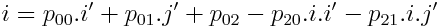

# Key Points for the key approaches in computer vision

## Sections

- [Images](#images-and-colour)
  - [Conversion formulae](#colour-conversion-formulae)
  - [Image noise](#image-noise)
- [Histograms](#histograms)
  - [Equalisation](#equalisation)
  - [Histogram Comparison](#histogram-comparison)
  - [Back Projection](#back-projection)
  - [K-Means Clustering](#k-means-clustering)
- [Binary](#binary)
  - [Thresholding](#thresholding)
  - [Alternative Thresholding](#alternative-thresholding)
  - [Mathematical Morphology](#mathematical-morphology)
- [Region Segmentation and Connectivity](#region-segmentation-and-connectivity)
  - [Connectivity](#connectivity)
  - [Segmentation](#segmentation)
    - [Region Based](#region-based)
    - [Edge Based](#edge-based)
- [Geometric Transformations](#geometric-transformations)
  - [Affine Transformations](#affine-transformations)
  - [Unknown Affine Transformations](#unknown-affine-transformations)
  - [Known Affine Transformations](#known-affine-transformations)
  - [Perspective Transformations](#perspective-transformations)
  - [More Comlpex Transformations](#more-complex-transformations)
  - [Brightness Interpolation](#brightness-interpolation)
  - [Removing Camera Distortion](#camera-models---removing-distortion)
- [Recognition](#recognition)

## Images and Colour

#### Colour Conversion Formulae

- **RGB to Greyscale: `Y = 0.299R + 0.587G + 0.114B`**
- CMY (Cyan Yellow Magenta): `C = 255-R`, `M = 255-G`, `Y = 255-B`
- YUV: `Y = 0.299R + 0.587G + 0.114B`, `U = 0.492*(B-Y)`, `V = 0.877*(R-Y)`
- **HLS - (Hue Luminance Saturation) - Separates colour and luminance - H = 0...360, L = 0...1, S = 0...1**
  - 

#### Image Noise

- Signal to Noise: `Clean Pixels/Noisy Pixels`
- Types of Noise: 
  - Gaussian - Gaussian distributed, good approximation to real noise
  - Salt and Pepper - Impulse noise, noise is max or min values
- Smoothing: the process of removing/reducing noise - risk of blurring sharp edges, loss of quality?
- Linear Smoothing Transformations
  - Image averaging - average based on n images (assumes: static camera & scene, statistical independence)
  - Local Averaging and Gaussian Smoothing: Averaging filters - local neighbourhood, can use different masks

- Non-Linear Smoothing Transformations 
  - Define multiple masks/regions - need to choose size and shape - use the average of most homogeneous mask
  - For each point - calculate dispersion, assign output point average of mask with min dispersion
  - 
  - Iterative application: convergence.
  - Median Filter - use median value, ignore average, noise resistant, computationally expensive, damages lines
  - Bilateral Filter - weight local pixels, distance from centre, difference in colour/instensity, preserves edges, but causes staircase
    - 
    - 
- Image pyramids: process at multiple scales efficiently 
  - Technique: Smooth image (e.g. Gaussian), sub-sample (generally by factor of 2)

## Histograms

- Represent global information about an image - independent of location/orientation - can use for classification
  - Not unique, different images can have v similar histograms
- Local minima/maxima are useful - but histograms are noisy, many local min/max
  - Smoothing - replace each value in histogram with local average e.g. `h[i] = (h[i-1]+h[i]+h[i+1])/3`
    - First and last values? Discard them/Replace with constant/Wraparound?
- Colour histograms - per channel histogram - colour space influences usefulness
- 3D histograms - Channels aren't independent - consider all simultaneously
  - 8 bits per channel is too much - 2 bits per channel - 64 cells

#### Equalisation
- Deals with poor contrast - redistribute greyscale in an image
  - When working with colour images, only change the luminance values

#### Histogram Comparison
- Use to find similar images - compares colour distributions

- Can also use Earth Mover's Distance: min cost of turning one distribution into another - easy for 1D, harder for 3D
- `EMD(-1) = 0` `EMD(i) = h1(i) + EMD(i-1) - h2(i)` `Earth Mover's Distance = sum of all EMD`

#### Back Projection
- Colour selection based on samples
  - Obtain a sample set - histogram the samples - normalize the histogram (max 1.0) - back project normalized histogram onto image f(i,j)
  - Result is **a probability image, p(i,j) indicating the similarity between f(i,j) and sample set**
  - Key considerations - size of hist bins (esp. when using limited sample set) & colour space
  
#### K-Means Clustering
- Method to reduce the variation in 3D colour space
  - Algorithm detects k exemplars to best represent image (pre-determined k) - colours are associated with the nearest exemplar forming clusters
  - Approach: **Get Starting exemplars** (random (leads to non. determinism)? manual selection? even distribution?) **First Pass:** for all pixels, allocate to nearest exemplar - shift exemplar to c.o.g of assigned colours after each assignment **Second Pass:** use final exemplars from first pass & realocate all pixels
  - **How many exemplars to use?** Less may reflect dominant features better (e.g. felt on snooker table), but more may get important detail (e.g. balls on snooker table)
  - **[Davies-Bouldin](https://en.wikipedia.org/wiki/Davies%E2%80%93Bouldin_index#Definition) index to find k:** iterates over the clusters generated - calculates the inter-cluster similarity - takes the worst result for each cluster, sums them and averages them - take k to be the number for which this value is lowest.
  - However: doesn't account for cluster size - cannot account for information retrieval

## Binary

#### Thresholding
- Used to convert a greyscale image into a binary image
  - Brief: Using some threshold, T, all values GTE set to 1, all values LT set to 0
- **Threshold Detection**
  - Manual Setting - magic number - what if lighting changes?
  - Automatic Threshold detection - vital - lighting declines consistently over time
  - Notation: `Image: f(i,j) Histogram: h(g) Probability Distribution: p(g) = h(g)/sum(h)`
- **Bi-Modal Histogram Analysis:** assume fg & bg are centered around 2 distinct greyscale values - use antimode between peaks
  - Drawbacks... histograms are noisy - smoothing/variable step would skew the anti-mode
- **Optimal Thresholding:** aims to deal with failings of bi-modal - i.e. handles noise, handles close modes
  - Model the histogram as the sum of two normal distributions
  - 
  - What the maths is doing: wb(Tt) calculates the weighting of the background for this threshold - literally speaking: the value between 0 and 1 which represents the amount of the image below the threshold wf(Tt) = 1 - wb(Tt) And then we calculate the mean of the fg distribution and bg distribution
  - The threshold is set to the halfway point between the two means. We iterate until the threshold is consistent.
- **Otsu Thresholding:** what if the distribution isn't normal - minimize spead on either side of threshold
  - Consider all thresholds, select the threshold which minimizes the within class variance
  - 
  - Relatively simple formula: calculate wb(T), wf(T) and the means as before, and then calculate the variance - i.e. instead of the sum of p(g)\*g as before, we use the sum of p(g)\*(g-<mean>)2
  - Can simplify this - minimum within class variance = maximum between class variance
  - Take max value for: 

#### Alternative Thresholding
- **Adaptive Thresholding:** divide an image into sub-images, threshold each sub-image, interpolate thresholds for each point using bilinear interpolation
- **Band Thresholding:** uses 2 thresholds - (theoretically) one below and one above object pixels
  - Border detector?
- **Semi Thresholding:** not used for much other than visualizing
  - If pixel GTE T, pixel retains greyscale value, else 0
- **Multi-Level Thresholding:** threshold all colours separately?
  - Can threshold in 3D colour space - define a 3D region in space, accept pixels within this space
  - Produces rough/pixelated binary images - require post processing

#### Mathematical Morphology
- Normal smoothing operations are inappropriate for binary images - we need clear edges
- Methods for removing noise in binary images - treat images as sets
- **Erosion: Removes noise and narrow bridges - use to remove borders**
  - Minkowski set subtraction
- **Dilation: Fill small holes and gulfs - used to add borders**
  - Minkowski set addition
- **Opening: Erosion followed by dilation - removes small objects(white pixels)**
  - Maintains approximate object sizes
- **Closing: Dilation followed by Erosion - removes small holes(black pixels)**
  - Maintains approximate object size, but distorts the shape
- Using mathematical morphology on a greyscale/colour images is also possible
  - Each level is considered to be set - all points GTE a given level undergo the morphology
  - Can be used to determine local maxima/minima

## Region Segmentation and Connectivity

#### Connectivity
- Lets us reason about objects in a scene, tell which pixels are connected
- Build a concept of regions using pixel adjacency
- **4 adjacency vs 8 adjacency:** alternate between them for best results
  - 4 adjacency on outer bg - 8adjacency on outer object - 4 adjacency on holes - 8 adjacency on objects in holes
- **Connected Components Analysis:** having identified regions, use a single adjacency to label each non-zero pixel
  - for every row: label each non-zero pixel - if previous pixels were all bg, assign new label - else pick a label from previous pixels, if any of the previous pixels have a different label, note equivalence

#### Segmentation
- Split image into smaller parts, preferably corresponding to particular objects

##### Region based
- **Watershed segmentation:** identify all regional minima - label as different regions - flood from minima to extend the regions - point of confluence between regions is a watershed line.
  - Minimum of what? Greyscale values/Inverse of Gradient/Inverse of Chamfer Distance
  - **Problems:** gives too many regions - can use pre-determined markers instead of minima
- **Meanshift Segmentation:** alternative to K-Means - doesn't require pre-determinednumber of clusters, and accounts for spatial location
  - **Kernel Density Estimation:** Given a sparse dataset, determine an estimate of density at each point - we use this to smooth the samples.
  - 
    - Where `n` is the number of samples, and `h` is the bandwidth
  - For a multidimensional dataset: 
  - Typically we use a uniform or Guassian kernel: 
  - **The algorithm of meanshift:** For each pixel: estimate KDE and the **mean shift vector**(direction of local increasing density), shift the particle to the new mean, recompute until stabilization Pixels which end in the same location form a cluster, assign local mean.
  - **The kernel density estimate is calculated using points within a spatial and colour range.** 
    - Requires a spatial and colour kernel - both can be gaussian, both limit and weight the considered points
  - We calculate our **mean shift vector** as: 
  - **Pros of Meanshift:** don't need to know the number of clusterns, accounts for spatial and colour differences
  - **Cons of Meanshift:** slow, selection of kernel is tricky

##### Edge based
  - Binary regions generally identified using edge detection

## Geometric Transformations

- Bring multiple images into a single frame of reference (mosaicing), remove distortion, simplify further processing
- **Given a distorted image f(i,j) and a corrected image f(i',j'), we model the transformation as: i = Ti(i',j') j = Tj(i',j')**
  - Note: that it works backwards - functions Ti and Tj take the corrected image coordinates and computes the corresponding images in the distorted image.
- Information is required to define the transformation: can be known in advance(image to known), can be determined through observations between images(image to image).
- So applying the transformation is: taking each point in the output image, determining where it comes from with T, interpolating its value
- **Why in reverse? In the case of expansion, working forwards would leave gaps in the output.**

#### Affine Transformations

- Definition: 
#### Unknown Affine Transformations
- Require at least 3 observations `(i0,j0)<=>(i0',j0') , (i1,j1)<=>(i1',j1') , (i2,j2) <=> (i2',j2')`
  - The more observations, the greater the accuracy
- Reorganise previous definition of affine transformations for three observations: [Three Observation Affine](../imgs/3observation-affine.png)
  - To compute the coefficients (`a` values), multiply both sides by inverse of the square matrix
  - Given >3 observations the matrix won't be square, so we use the psuedo inverse

#### Known Affine Transformations
- **Translation**
  - 
- **Rotation**
  - 
- **Change of Scale**
  - 
- **Skewing**
  - 
- **Panoramic Distortion**
  - 
  
#### Perspective Transformations
- **Perspective Transformations are needed when a planar surface lies in a plane which is not parallel to the image plane**
- 
  - More complex thana affine transformation
- **Requires at least 4 observations**
- Can tell from given formula:     [Perspective J](../imgs/perspective-j.png)
- Reorganising that gives us: ![Perspective Matrix]{../imgs/perspective-matrix.png)
  - Multiplying by inverse of square matrix gives us coefficients
  - Given >4 observations means we need to use psuedo inverse

#### More Complex Transformations

- Approximation by Polynomial - used in medical imaging combine images taken with different sensors
  -  
  - The number of observations required is half of the terms in the polynomial
  - If a geometric transformation is too complicated, we can partition the image, and determine a transformation per partition

#### Brightness Interpolation

- The mapping from corrected image to real image is not on a per pixel basis i.e. the corrected image maps back to *real coordinates*
- The value at each pixel is interpolated
- **Three interpolation schemes**
  - **Nearest Neighbour interpolation**
  - `f'(i',j') = f(rounf(i),round(j))` - take the value from the nearest pixel in the original image - blocky effects
  - **Bilinear interpolation**
  - `f'(i',j') = (trunc(i)+1-i)(trunc(j)+1-j)f(trunc(i),trunc(j)) + (i-trunc(i))(trunc(j)+1-j)f(trunc(i)+1,trunc(j)) + (trunc(i)+1-i)(j-trunc(j))f(trunc(i),trunc(j)+1) + (i-trunc(i))(j-trunc(j))f(trunc(i)+1,trunc(j)+1)`
  - Assumes brightness is bilinear - average brightness about the point (trunc(i),trunc(j)), weighted with their distance - blurs the image
  - **Bicubic interpolation**
  - Approximate the brightness using a bi-cubic polynomial surface - accounts for the 16 neighbouring pixels so no blurring
  - Similar to laplacian

#### Camera Models - Removing Distortion

- **Radial Distortion**
  - Two Forms
  - Barrel Distortion - radial distortion where magnification decreases as distance from optical axis increases
  - Pincushion Distortion - radial distortion where magnification increases as distance from optical axis increases
  -   
- **Tangential Distortion**
  - Caused by uneven magnification from one side to the other in an image i.e. lens not parallel to image plane
  -  
  - Where p1 and p2 are parameters describing the distortion.

## Recognition

- Lets us see what is in an image

#### Template Matching
- **Basic Algorithm**
  - Evaluate a match criterion for each possible position of the template in the image, search for local maxima above a threshold
- **Matching Criteria**
  - 
  - 
    - **0 is optimal, 1 is worst**
  - 
  - 
    - **0 is worst, 1 is optimal**
  - Cross correlation ignores luminance
  - Generally don't compute a value at the boundaries as the degree-of-fit will be inconsistent
- **Control Strategies**
  - Select greatest value in a local neighbourhood - typically use a neighbourhood of 8 - prevent duplicate matches
  - Process using an image hierarchy - process at increasing resolutions - use matches at low res as a guide - inappropriate for detailed templates

#### Chamfer Matching
- Template matching requires very close matches - generally not possible (noise/orientation)
- **Chamfer matching is an encoding for each pixel of its distance to the nearest object (edge)**
  - Algorithm: For each point, if it is an edge point, set it's value to 0, else ignore.
  - Iterate over every non edge point, finding the distance to the nearest edge.
- The template in chamfer matching is a binary template in which only the object pixels are set and considered
  - The metric is the sum of the overlapping values (0 is optimal)
  
#### Statistical Pattern Recognition (SPR)
- Derive features from known objects, use the features to classify unknowns based on the similarity to this shape
- Probability recall: **Independent Events:** `P(AB) = P(A)P(B)` **Dependent Events:** `P(AB) = P(A|B)P(B)`
  - Use probability to give the probability that an object is of a class, Wi, given some features: `P(x|Wi)`
  - Essentially a probability density function of a value occuring for that class
- `P(x|Wi)` is the likelihood given the class (a-priori), but we care more about the probability of the class given some value: `P(wi|x)`
- **Bayes Theorem:** For two classes A and B, the a-posteriori proabbility it: `P(B|A) = [P(A|B)P(B)]/P(A)`
  - So, where Wi forms a partitioning of the event space: `[P(x|Wi)P(Wi)]/sum(P(x|Wi)P(Wi))`
- **Example Features:** area, minboundingrect, convex hull, elongatedness, concavities, holes, perimeter length
- **Advantages:** Accurate
- **Disadvantages:** Needs training, requires decent training set

#### Support Vector Machines (SVM)
- Works for 2 class problem - considers 2 linearly seperable classes in n-dimensional feature space
- Finds hyperplane of max-margin between the classes
- Define separating hyperplanes: `w.x + b = 0 , w.x + b = 1 , w.x + b = -1`
  - Constraint: 
  - Given a point x+ on w.x+b=1 and x- is the nearest point on w.x+b=-1...
  - Then: 
  - Multiply by w...: 
  - Therefore: 
  - So we need to minimise |w| to maximise the separation, subject to our constraint: 
- **Lagrangian Optimisation**
  - Can optimise (i.e. find minimum |w|) using Lagrangian optimisation
   - 
  - We find minimums by setting partial derivatives to 0
- So we can now classify by passing an observed feature vector into the original equation, and classifying based on whether it is positive or negative
  - If classes aren't linearly separable - replace dot products with a non-linear kernel, or use soft margin SVMs

#### Cascade of Haar Classifiers (Haar)
- Robust object detection using cascade of classifiers - only uses simple features (efficient)
- Learns based on samples of positive and negative
- Selects a large number of features during training and creates classifiers to accept/reject based off them
  - Classifiers are ordered sequentially (cascade) - if a sub-image is rejected by any classifier, it is rejected
  - **Efficient: Most sub-images are stopped by first or second classifier**
- Classifiers are designed to resize easily
- Features are determined as the difference of the sums of a number of rectangular regions
  - Place mask in specific location, at specific scale
  - Subtract the normalized sum of white pixels (white region of mask) from the normalized sum of black pixels (black region of mask)
- **Training**
  - Needs a large number of samples (positive and negative), calculates hundreds of thousands of possible features
  - Selects the most important features, for specific points in the cascade
- **Weak Classifiers:** combine a specific feature with a threshold, comparison to this threshold is the accept/reject decision
- **Strong Classifiers:** Combine a number of weak classifiers using Adaboost.

#### Principal Components Analysis (PCA)
- Statistical Technique for data analysis, compression and recognition - analyses data covariance, identifying principal directions
- Example: given 2D data, and N samples/vectors, find the mean sample, the direction of maximum covariance, and the direction orthogonal to this.
- **Background - Eigenvalues and Eigenvectors**
- Given a square matrix, A, the eigenvalues are the roots of the characteristic equation:
  - 
  - For each eigenvalue, there will be an eigenvector, x, such that: 
- For an n\*n matrix, there will be n eigenvalues, consider n=2:
  - There will be 2 eigenvalues, and 2 corresponding eigenvectors, such that:  
  - 
- **Back to PCA**
- N samples/vectors in some n-dimensional space, which we then combine into data matrix D where each row is a sample
- **Calculate the mean of the samples:** for each feature, calculate the mean value
- **Compute the mean-centred data U:** subtract the mean value for each feature, from each instance of it in D
- **Using mean-centred data U, calculate a covariance matrix**
  - 
  - We can then determine: 
  - **Where the eigenvectors are in an orthogonal matrix, phi**
  - **And the eigenvalues are in an ordered diagonal matrix, Lambda** - the amplitudes of the eigenvalues are proportional to the percentage of overall variance accounted for by the associated eigenvector

#### Performance Metrics
- **Computation Time**
  - How long did it take?
- **Success and Failure Rates**
  - Require some ground truth - manually computed
  - Metrics based around: True Positives(TP), True Negatives(TN), False Positives(FP), and False Negatives(FN)
  - Computing: 

## Edges

#### Edge Detection
- Analysis of the discontinuities in an image - an abrupt change in brightness
- **Edges have magnitude(gradient), and direction(orientation)**
- **1st Derivation Edge Detection**
- The first derivative is the rate of change in two directions, can calculate the gradient, and orientation
  - Gradient: 
  - Orientation: 
- **Roberts Edge Detector**
  - Uses two partial derivatives to compare diagonal differences between pixels:  
  - Two convolutional masks, moved across the image to compute the function
  - RMS computes the gradient, inverse tan gets the angle
  - Only should really be used on binary - change is too gradual otherwise (only considers adjacency)
  - Edges are a half pixel out due to the result being between the two partial derivs
- **All edge detectors should: cross at a single middle point (ideally the centre of a pixel), evaluate points that aren't too close together and handle noise**
- **Compass Edge Detectors (Prewitt and Sobel)**
  - Partial Derivatives defined for a number of orientations (typically 8), we generally just take 2 orthogonal ones
  - **Prewitt:** all compass point permutations comprised of 1s,0s, and -1s
  - **Sobel:** same matrices as Prewitt, but the centre 1 and -1 is changed to 2 and -2 respectively.
  - These masks implement smoothing, account for more distant pixels, and have a real centre.
- **Thresholding**
  - Simple thresholding will give us too few or too many points
  - **Non-Maxima Suppression:** Use gradient and orientation info to identify central edge points
    - Orientations are quantised to 8 values (compass points), use this info to compare an edge pixel to the pixel 'ahead' and 'behind' of the current one.
- **2nd Derivative Edge Detection**
  - **Laplace operator**
  - 
  - High weighting of the central pixel makes this approach susceptible to noise, so follow with smoothing
- 2nd Derivative Edge Detectors find the edges without orientation - location and gradient
  - **Gradient Magnitude = slope of zero crossing** - very computationally expensive, so use magnitude from first deriv
  - 2nd derivative gives far greater edge location accuracy
- **Marr-Hildreth Edge Detection**
  - 2nd derivative zero crossings
  - Requirees smoothing - filter must be smooth and band limited - spatially localised (prevents edges being moved)
  - Optimal solution is Gaussian Filter: 
- **Laplacian of Gaussian:** Combine the application of gaussian smoothing and the laplacian operator.
  - 
  - Gives us the mexican hat filter: strong positive in centre, drops to negative and then zeros out.
  - **Pros:** takes into account large area, guarantees closed loop of edges
  - **Cons:** can miss edges if nucleated, loses corners from smoothing, can be expensive
- **Multi-Scale Edge Detection**
  - Processing at multiple scales simultaneously gives us information we otherwise would not have
  - Use multiple gaussians on one image to obtain a sense of scale, taking common discontinuities to be edges
  - **Canny**
  - Coimbines first and second derivatives - **obtains magnitude and orientation**
  - Optimises: detection, localisation, single response
  - Algorithm: convolve image with Gaussian Estimate edge orientation using first derivative Locate the edges, perform non-maxima suppression using zero-crossing Compute edge magnitude using first derivative Threshold edges with hysteresis and repeat for multiple scales Feature synthesis
- **Multispectral(colour) Edge Detection**
  - Can be difficult: different colours have similar greyscales
  - 3 primary approaches: **Vector methods** - treat colours as vectors, calculate median vector and vector distance, use these to compute magnitude and orientation **Multidimensional gradient methods** - gradient and orientation are computed using data from all three channels - expensive **Output fusion methods** - Separate computation of gradient and orientation for all channels and then combine them into one using weighted sum.
