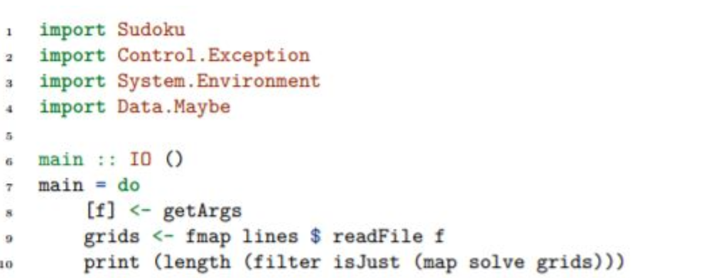
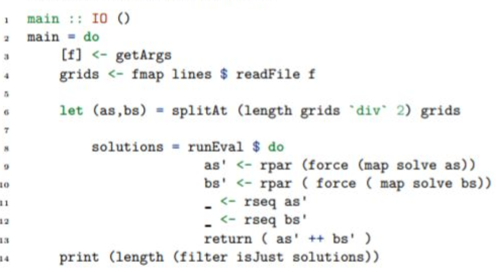
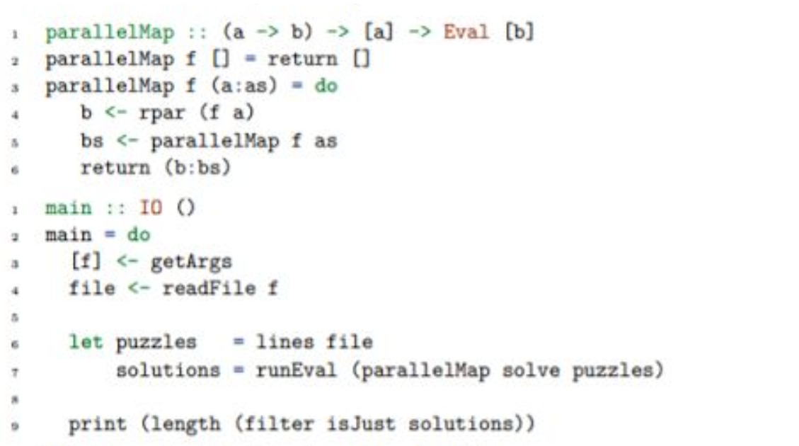
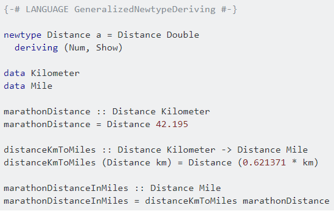

### An attempt to condense the topics on the course into one file, if anything isn't clear, [read the full notes](https://github.com/lfarrel6/Study-Stuff/tree/master/Haskell/Notes)

### (Examinable) Topics

  - [Monads](#monads)
  - [Monad Transformers](#monad-transformers)
  - [Parallelism](#parallelism)
  - [Concurrency](#concurrency)
  - [Embedded DSLs](#embedded-dsls)
  - [Implementing Type Inference](#implementing-type-inference)
  - [Advanced Type Systems](#advanced-type-systems)
  
### Monads

##### What are monads?
  - [Composable computation descriptions](https://wiki.haskell.org/Monad)
  - Used to structure programs, maintain referential transparency, and group actions with common behaviours.
  
  - Minimum Requirements for a monadic instance
    * `return` - a simple function which takes a value and lifts it into a monad (`return :: a -> m a`)
    * `>>=` - a.k.a bind - used to compose monadic computations (`(>>=) :: m a -> (a -> m b) -> m b`)
    
  - Examples of Monads:
    * `IO` - used to perform what would otherwise be unsafe IO actions
    * `State` - used to provide the concept of a state, and the result of some 'stateful' computations
    * `Maybe` - used to handle the concept of failure in computations, successful computations result in a value wrapped by `Just`, and failure results in `Nothing`
    * `Either` - similar to Maybe but returns a value on failure, successful computation returns a `Right` wrapped value, while failure returns a `Left` wrapped value (typically a string explaining the error)
    * `[]` - lists in Haskell are also monads. Compare to maybe: can fail and give `[]` (which is nothing), or succeed and give some values (like `Just`)

  - Monad Laws
    * Left Identity: `return a >>= f = f a`
    * Right Identity: `m >>= return = m`
    * Associativity: `(m >>= f) >>= g = m >>= (\x -> f x >>= g)`
    * **Simply put:** [monad composition is an associative operator with left and right identities.](https://wiki.haskell.org/Monad_laws)
    
  - Applicative Functors
    * GHC 7.10 added new abstraction: Monad class was refactored to **Functor**, **Applicative**, and **Monad**
  
  - Functors (each mention of f refers to a Functor)
    * Class for types which can be mapped over, allows us to apply functions to wrapped (functorial) values
    * Provides `fmap :: (a -> b) -> (f a -> f b)` which can be used as an infix operator using `<$>`
    * `fmap` takes a function `(a -> b)` and lifts it into the context of a wrapped value `(f a -> f b)`
    * **First Functor Law:**  `fmap id = id`
    * **Second Functor Law:** `fmap (g. h) = fmap g . fmap h`
    
  - Applicatives (each mention of f refers to an Applicative, the term morphism refers to `f (a -> b)`)
    * More Structured than functors
    * Provides `<*>` which essentially lets us apply more args to `fmap` arbitrarily
    * `(<*>) :: f (a -> b) -> f a -> f b`
    * Also provides `pure` which wraps its argument into the correct type
    * `pure :: a -> f a`
    * **First Applicative Law - Identity:** Applicatives preserve identity. `pure id <*> v = v`
    * **Second Applicative Law - Homomorphism:** Applicatives preserve function application. `pure f <*> pure x = pure (f x)`
    * **Third Applicative Law - Interchange:** Applying a morphism, u, to a `pure` value y is the same as applying `pure ($ y)` to the morphism. `u <*> pure y = pure ($ y) <*> u`
    * **Fourth Applicative Law - Composition:** Applicatives maintain composition (i.e. `pure (.)` acts on morphism as `(.)` acts on functions)`pure (.) <*> u <*> v <*> w = u <*> (v <*> w)`

  - Monads (Post GHC 7.10)
    * **All Monads are also Functors and Applicatives**
    * `(>>=) :: m a -> (a -> m b) -> m b`
    * `return :: a -> m a`
    * `fail :: String -> m a`
    * Monads post 7.10 provide the same functionality, Functors and Applicatives just capture some of the more general behaviour
    * Functors and Applicatives can make defining a monadic instance easier: `return = pure` is a satisfactory definition
    * And if defining the instance of Functor for a Monad, we can also use `fmap = liftM`

##### [Further explanation of Functors, Applicatives, and Monads, and their relationship.](https://en.wikibooks.org/wiki/Haskell/Applicative_functors)

##### A nice extract from this article :point_up:
  - **Functor, Applicative, Monad - A sliding scale of power**
  - Ignoring `pure`/`return`, each class can be said to have a characteristic method
    * `fmap :: Functor f => (a -> b) -> f a -> f b`
    * `(<*>) :: Applicative f => f (a -> b) -> f a -> f b`
    * `(>>=) :: Monad m => m a -> (a -> m b) -> m b`
  - They all look very different... **but lets change fmap to its infix synonym `(<$>)`, and flip `(>>=)` to get `(=<<)`**
    * `(<$>) :: Functor t     =>   (a ->   b) -> (f a -> f b)`
    * `(<*>) :: Applicative t => t (a ->   b) -> (f a -> f b)`
    * `(=<<) :: Monad t       =>   (a -> t b) -> (t a -> t b)`
  - All the type signatures line up and are very similar! So now we can see the similarities, as well as the differences
    * `fmap` maps arbitrary functions over functors
    * `(<*>)` maps `t (a -> b)` *morphisms* over applicative functors
    * and `(=<<)` maps `a -> t b` functions over monadic functors
  - The influence of the types of `fmap`, `(<*>)`, `(>>=)`
    * `fmap` ensures that we cannot change the context no matter what function we give it. This is because the `(a -> b)` argument has nothing to do with the functorial context t, so its application can have no influence on that context.
    * So `fmap` gives the guarantee of safety. For example, `fmap f xs` where `xs` is some list can **never** change the number of elements of the list.
    * `(<*>)` then gives us a way to apply functions with context i.e. morphisms. This lets us change context. For example, `[(2*),(3*)] <*> [2,5,6]` creates a list of 6 elements (which isn't possible with a Functor).
    * We combine a morphism with its own context, `t (a -> b)` and combine it with a functorial value `t a`. This has a subtlety to it. While `t (a -> b)` is within context `t`, the `(a -> b)` of this morphism cannot modify the context. **So applicatives can perform fully deterministic context changes, restricted by the context of the argument.**
    * A simple way to think about it, using the `[(2*),(3*)] <*> [2,5,6]` example: knowing that the use of `<*>` on list results in the application of every function to every value, we can *definitively* say what the length of the resulting list will be based on the lengths of the inputs. I.e. `(<*>)` applied to a list of length 2, and a list of length 3, is *guaranteed* to give a list of length 6. We lose this guarantee when we move into monads.
  * `(>>=)` takes in a `(a -> t b)` **which can create context from values!** This provides flexibility.
  * Monads introduce a knock-on effect of computation: the result of the first computation may influence the second. Think about binding `Maybe` computations, if the first evaluates to `Nothing` then we won't even attempt the second computation.

##### How would we let the compiler know that the Functor we are defining is also a Monad?

##### Haskell Type Classes

  - Haskell uses type classes to explicitly restrict polymorphic types to have certain behaviours
  - Example: Equality
    * The type of equality (intuitively) is `(==) :: a -> a -> Bool` - i.e. for all types a, we take two a values and return a boolean of their equality
    * In haskell, the type is `(==) :: (Eq a) => a -> a -> Bool` - i.e. for all types a which are part of the Equality class, take two values and return a boolean of their equality
  - This is **Ad-Hoc polymorphism**
    * Equality is polymorphic (using `a`)
    * But it is ad-hoc - it requires a specific implementation of the `Eq` methods for a given type
    * In contrast, list length displays parametric polymorphism (no type dependency) `length [] = 0 | (x:xs) = 1 + length xs`
    * Ad-hoc polymorphism is everywhere: the overloading of `+`
    * Overloading is built into many languages, but is in Haskell as a language feature (type classes) - can easily create new instances
    * If we wanted to define our own: Specify the name/operator (==) , Describe its pattern of use (`a -> a -> Bool`) , Provide a class name for the concept (Eq)
    * To then use our operator with a given type (e.g. Bool) we would provide an implementation for that type
  - How does Haskell interpret class name/operator?
    * Notes the association between symbol and class
    * Deduces the type of the args, and verifies that there is an instance of the type for the class
    * If it is well typed: generates the appropriate code
    * Else: suggests you add an instance declaration for your type in the class

##### Some standard prelude classes

Type of Behaviour | Classes
----|----
Relation | Eq, Ord
Enumeration | Enum, Bounded
Numeric | Num, Real, Integral, Fractional, Floating, RealFrac, RealFloat
Textual | Show, Read
**Categorical** | **Functor, Monad**

### Monad Transformers

  - Implementations can be found in [Sean's repo](https://github.com/McGizzle/CS4012-Functional-Programming)
  - Monads do not compose naturally
    * E.g. we might want to have a `State` monad with error handling from `Maybe`
    * `newtype SM s a = SM (s -> Maybe (a,s))` vs `newtype SM s a = SM (s -> (Maybe a, s))`
    * Not clear which is right *(possibly neither)*
    * Using a type like `IO (Maybe a)` would work, but would force us to pattern match in do blocks even though the maybe monad provides that feature.
  - So we use Monad transformers to to handle this composition
    * **We use transformers to combine/mix desired effects from different monads.**
    * `class Monad m => Err m where`<br>`eFail :: m a`<br>`eHandle :: m a -> m a -> m a`<br>**For a monad `m`, we can transform it into a monad which maintains the effects of `m`, but can also error handle using `eFail` and `eHandle`**
    * To make it useful, we define a way to access the operations of `m`
    * `class (Monad m, Monad (t m)) => MonadTransformer t m where`<br>`lift :: m a -> t m a`
    * `lift` allows us to bring a monadic computation (of the `m` monad) into the context of our transformer, `t`
    * There is an example concrete instance ErrTM [here.](https://github.com/lfarrel6/Study-Stuff/blob/master/Haskell/Notes/Monad%20Transformers.pdf)
  - Haskell provides monad transformers in several libraries, we looked at the mtl library in the course
    * The mtl library requires any monad transformer to be an instance of the type class `MonadTrans` (which simply provides `lift`)
    * Then, to provide any compatability, the transformer must become an instance of the type class of any monad with which it is compatible e.g. `MonadState`
  - There isn't too much else on MonadTransformers that springs to mind, other than implementing our own ones. Again, [@Sean'sRepo](https://github.com/McGizzle/CS4012-Functional-Programming)

### Parallelism

  - A natural fit in functional programming due to immutable data, and side-effect free computation
  - While we have no worry of deadlocks, starvations, synchronization, and locks, we have to pay attention to execution granularity
  - `Control.Parallel` library gives us access to necessary functions to invoke some parallelism
  - **`par :: a -> b -> b`** - `par x y` is semantically equivalent to `y` but we are hinting that parallelism may be possible here
  - **`pseq :: a -> b -> b`** - `pseq x y` semantically means evaluate `x` before `y`, returning `y`
    * So to calculate fibonacci numbers, we might say: <br>`fib n | n < 2 = 1`<br>`fib n = par nf1 (pseq nf2 (nf1 + nf2))`<br>`where nf1 = fib (n-1)`<br>`nf2 = fib (n-2)`
    * Which can be read as *"evaluate nf1 while at the same time/in parallel (evaluate nf2, followed by nf1+nf2)"*
    * Overheads would become an issue for a large n, an example of how to limit the thread count can be found [here.](https://github.com/lfarrel6/Study-Stuff/blob/master/Haskell/Notes/Parallelism.pdf)
  - **The Eval Monad**
    * `Control.Parallel` has more to it
    * **Facilitates the separation of algorithm and evaluation strategies**
    * The Eval monad is to the Identity monad, as `par` is to the identity function
    * `runEval :: Eval a -> a`<br>`rpar :: a -> Eval a` - my argument could be evaluated in parallel<br>`rseq :: a -> Eval a` - evaluate my argument and wait for the result
    * `fib d n = runEval $ do`<br>`nf1 <- rpar $ fib (d-1) (n-1)`<br>`nf2 <- rseq $ fib (d-1) (n-2)`<br>`return $ nf1 + nf2`
  - `Control.Parallel.Strategies` provides many utilities for exploiting parallelism
    * Strategies for specifying strictness (i.e. playing the role of `seq`)
    * Higher level functions for applying `parList`, `parListChunk`, etc. which can model algorithms like map-reduce
  - **Example of Strategy Application**
    * Given a sudoku solver: `solve :: String -> Maybe Grid`
    * **Sequential**<br>
    * **Basic Parallelism**<br>
    * Our basic parallelism is more efficient but maybe we could make further improvements...
    * **Building Eval Monad utilities**<br>
    * ParallelMap simply performs a parallel mapping of the solver method onto each element in the list
  - `Control.Parallel.Strategies` gives us `Strategy`, which represents a parameterized hof to capture attempts to introduce parallelism
    * `type Strategy a = a -> Eval a`
  - Example strategy: evaluate pairs in parallel
    * `parPair :: Strategy (a,b)`<br>`parPair (a,b) = do a' <- rpar a`<br>`b' <- rpar b`<br>`return (a',b')`
  - We can then apply these strategies by creating a function `using`:
    * `using :: a -> Strategy a -> a`<br> ```x `using` s = runEval (s x)```
  - The Strategies are parameterised allowing us to do things like...
    * Make multiple pairwise evaluation strategies using a h.o.f
    * (This is desugared do notation for practice)<br>`evalPair :: Strategy a -> Strategy b -> Strategy (a,b)`<br>`evalPair sa sb (a,b) = sa a >>= \a' -> sa b >>= \b' -> return (a',b')`
    * This function takes two strategies and a pair of values, and returns the application of the strategies to the values (would still need runEval to compute however). By using partial application we can build new strategies with this:<br>`parPair = evalPair rpar rpar`<br>`parSeqPair = evalPair rpar rseq`<br>And simply evaluate them... `runEval $ parPair (f x,f y)`
    * Similarly we have: `evalList :: Strategy a -> Strategy [a]`<br>`evalList s [] = return []`<br>`evalList s (x:xs) = s x >>= \x' -> evalList s xs >>= \xs' -> return (x':xs')`
    * We can also use the provided `rparWith` function of type `Strategy a -> Strategy a`, which wraps an `rpar` around its argument strategy.
    * So we could define this:<br>`parList :: Strategy a -> Strategy [a]`<br>`parList s = evalList (rparWith s)`
    * We could have defined our sudoku solver as: ```let solutions = map solve puzzles `using` parList rseq```
    
### Concurrency

  - Concurrency introduces the risk of non-determinism due to the interleaving of threads
  - The basic primitives for threads are very simple:
    * Spawn a new thread: `forkIO :: IO () -> IO ThreadId` e.g. `forkIO (forever $ putChar 'o')`
    * Kill a thread: `killThread :: ThreadId -> IO ()`
    * Delay a thread: `threadDelay :: Int -> IO ()` (the `Int` param is the millisecond delay)
    * So we could run two threads: `main = forkIO (forever $ putChar 'o') >> forkIO (forever $ putChar 'O') >> threadDelay (10^6)`
  - **We need to get some form of interthread communication for most non-trivial applications**
    * **Channel (Unbounded FIFO)**
    * Permits writing whenever you like, but *reading will block until there is something to read*
    * `newChan :: IO (Chan a)`<br>`writeChan :: Chan a -> a -> IO ()`<br>`readChan :: Chan a -> IO a`<br>`getChanContents :: Chan a -> IO [a]`<br>`isEmptyChan :: Chan a -> IO Bool`<br>`dupChan :: Chan a -> IO (Chan a)`
    * Threads can use these channels to communicate
    * E.g. `main = hSetBuffering stdout NoBuffering >> newChan >>= \c -> forkIO (worker c) >> forkIO (forever & putChar '*') >> readChan c`<br>`worker :: Chan Bool -> IO ()`<br>`worker c = mapM putChar "Printing all the chars" >> writeChan c True`
    * The main function creates a thread to run the worker function in, and then the main creates a thread to print infinite '\*'s, the main thread then locks on its readChan request. The worker function prints each char from "Printing all the chars", and then writes True to the channel, at which point the main function can finish, killing all threads.
    * **So Channels give us a nice way to communicate, but can create deadlocks.**
    * Channels are typically used in Servers (Thread per connection), BG processes (data computed by a thread becomes available incrementally)
  - **Chans aren't the basic communication primitive in Haskell...**
  - **MVar**
```haskell
newEmptyMVar :: IO (MVar a) -- An MVar can either be empty or full
takeMVar :: MVar a -> IO a -- calling `takeMVar` on an empty MVar will block
putMVar :: MVar a -> a -> IO () -- calling `putMVar` on a full MVar will block
```
  * MVars can be used as a mutex for shared state, a one-item channel, or **they can be used to build larger abstractions, like Chan**
  - **Building Channels from MVars**
    * We need to mimic the properties of a channel...<br>*Block reads when empty*<br>*Allow writes at any point*
    * First difference between an MVar and a Chan is that MVars only take a single item, so we need a list with some form of sequencing to reflect time...
    * **A linked list of MVars**
```haskell
type Stream a = MVar (Item a)
data Item a = Item a (Stream a)
data Chan a = Chan (MVar (Stream a)) -- read pointer
                   (MVar (Stream a)) -- write pointer

newChan :: IO (Chan a)
newChan = do
  hole <- newEmptyMVar
  readVar <- newMVar hole
  writeVar <- newMVar hole
  return (Chan readVar writeVar)
```
  * So to create a new Channel...<br>We create an empty `MVar`, hole.<br>We place hole into both pointers of the `Chan`, so when initialised the read and write pointers are pointing to the same empty `MVar`.<br>This successfully mirrors the behaviour of `Chan`.
```haskell
writeChan :: Chan a -> a -> IO ()
writeChan (Chan _ writeVar) val = do
  newhole <- newEmptyMVar
  oldhole <- takeMVar writeVar
  putMVar oldhole (Item val newhole)
  putMVar writeVar newhole
```
  * Writing to a Channel...<br>It is easiest to understand if we use the first write instance.<br>We create a new `MVar`, newhole.<br>Then take the current `MVar` from `writeVar`, `oldhole` (in this instance of first write, this is also the hole of `readVar`).<br>Put the new value, `val`, and new `MVar`, `newhole`, into the old `MVar`, `oldhole` (in the first instance, this is the read pointer so it now has data).<br>Put the `newhole` into the writeVar, so the write end of the `Chan` is still empty.
```haskell
readChan :: Chan a -> IO a
readChan (Chan readVar _) = do
  stream <- takeMVar readVar
  Item val new <- readMVar stream -- note the use of readMVar here - we don't need to take it, just get its contents
  putMVar readVar new
  return val
```
  * Reading from a channel...<br>Take the `MVar` from the `readVar` (the value at the reader pointer).<br>Take the `MVar` stored within it (Recall `Item`, `Stream` definitions - `val` = information, next = next `MVar`).<br>Put new into `readVar` to move the pointer on.<br>Return the information that we saw.
```haskell
dupChan :: Chan a -> IO (Chan a)
dupChan (Chan _ writeVar) = do
  hole <- takeMVar writeVar
  putMVar writeVar hole
  newReadVar <- newMVar hole
  return (Chan newReadVar writeVar)
```
  * Duplicate the channel, the aim of this function is to create a second channel which shares the `writeVar` but has a separate read pointer.<br>Take the `MVar` in `writeVar`, `hole`.<br>Place the `MVar` back into the `writeVar`, and then create a new `readVar` using the same `MVar`, `hole`. (As `writeVar` will always refer to an empty `MVar`, this works).<br>Return a new `Chan` with the `newReadVar` and same `writeVar`.

```haskell
unGetChan :: Chan a -> a -> IO ()
unGetChan (Chan readVar _) val = do
  newReadEnd <- newEmptyMVar
  readEnd <- takeMVar readVar
  putMVar newReadEnd (Item val readEnd)
  putMVar readVar newReadEnd
```
  * This function puts a value in from the read end of the `Chan`.
  * What happens in an empty `Chan`?
    * `takeMVar` would block, and if this were not the case, an empty MVar would be pushed into the list.
  - **STM - Software Transactional Memory**
  - STM tries to solve the problems of shared-memory concurrent programs - locks, races, deadlocks, etc.
  - STM borrows the concept of transactions from DBs - **atomic computation**.
  - Using `atomically $ do`
    - Atomic blocks of code will commit in an all or nothing way.
    - Isolated execution, and no deadlocking (can generate exceptions however).
    - **How? Optimistic Concurrency**
    - Execute our code, lock free and log all memory accesses without executing them. At the end, commit the log, retrying blocks on failure.
    - Code within a transaction is unaware of changes made by any other transaction - *So when two transactions are executing concurrently, the first to complete is commited, and the second will see conflict on completion, and retry.*
  - **Too good to be true? There are some restrictions.**
    - We cannot have side-effects within our atomic blocks.
    - We cannot touch any transaction variables outside of an atomic block.
  - **Type system helps us out here...**
    - `Atomically :: STM a -> IO a`
    - `STM` monad actions have side-effects, but they are more limited than the `IO` ones
    - Mainly reading and writing special transaction variables, `Tvar`s
```haskell
newTVar :: a -> STM (TVar a)
readTVar :: TVar a -> STM a
writeTVar :: TVar a -> a -> STM ()
```
  - Semantically, a `TVar` is a value container. **Note: They do not have the same blocking semantics as MVars.**
  - The type sysytem doesn't allow the execution of `STM` actions outside of an `atomically` or the `STM` monad
  
  

### Embedded DSLs

### Implementing Type Inference

### Advanced Type Systems

  - A large part of Haskell's power is due to its type system, which has several interesting extensions
  - **Phantom Types**
    * A phantom type is **"A type parameter that isn't mentioned anywhere in the body of the declaration"**
    * e.g. in `newtype Ty a b = T a`, `b` is a phantom type as it never appears on the RHS
    * How are phantom types useful?
    * Imagine we have a system which tracks distance in both Kilometers, and Miles. We really don't want to mix Kilometers and Miles.
    * So in other words, we would like to give the compiler some embedded knowledge of the unit of distance that we are using. This is perfect for phantom types.
    * 
    * We could make a data type to mimic pointers, and use phantom types to make it more safe
    * e.g. `data Ptr a = MkPtr Addr`
    * Give it some helpful functions: `peek :: Ptr a -> IO a` and `poke :: Ptr a -> a -> IO ()`
    * And now this will be rejected by the compiler:<br>`do ptr <- allocate`<br>`poke ptr (42::Int)`<br>`bad::Float <- peek ptr`
    * We can have polymorphism in phantom type parameters, seen [here.](https://github.com/lfarrel6/Study-Stuff/blob/master/Haskell/Notes/Advanced%20Type%20Systems.pdf)
  - **Existential Types**
    * Lists are normally homogenous i.e. `data List a = Nil | Cons a (List a)`
    * So the type checker rejects a list like `["foo","bar",12.3]` as *there is no single 'a' which can be universally quantified over the body of the list.*
    * But by rejigging the definition of list we can put the quantifier inside the declaration...
    * instead of `data forall a . HList a = ...` we can say `data HList = HNil | forall a . HCons a HList`
    * **This is called existential quantification.**
    * We can see from the data type that the existential type doesn't appear in the result type i.e. the constructor produces `HList` (no `a` in the type!)
    * This comes with quite a few problems... For example, `show` won't be able to find an instance for a type `a` which works for a heterogenous type (because one type can't be many types.. huh)
    * A workaround exists: make our list hold tuples, containing the data and useful functions to make the data usable
    * E.g. if we wanted to print the data we could redefine our list: `data HList = HNil | forall a. HCons (a, a -> String) HList`
    * so an example list might look like: `f = HCons ("foo", id) (HCons ("bar", id) (HCons (12.3, show) HNil))`
    * This is pretty nasty though - it looks bloated. **Use a type class system: `data HList = HNil | forall a. Show a => HCons a HList`**
    * This lets us create a list where the only guarantee for each element in the list, is that it is of a type which has some property `Show`.
    * **So Existential Quantification is a way to 'squash' a group of types into a single type.** For example, our definition of `HList` earlier can 'squash' the types `String`, `Int`, and `Bool` into a single type, `a` (which has the restriction `Show a => a`).
  - **Generalized Algebraic Data Types (GADTs)**
    * ["A generalization of the algebraic datatypes that you are familiar with."](https://en.wikibooks.org/wiki/Haskell/GADT)
    * **They allow you to explicity write down the types of the constructors.**
    * Primarily used for implementing DSLs. Examples of Arithmetic expression DSLs motivating GADTs can be found [here](https://github.com/lfarrel6/Study-Stuff/blob/master/Haskell/Notes/Advanced%20Type%20Systems.pdf), and [here](https://en.wikibooks.org/wiki/Haskell/GADT).
    * To summarise the impact of GADTs: in Haskell, the constructor functions for `Foo a` have `Foo a` as their return type (e.g. `Nothing :: Maybe a`, `Just :: a -> Maybe a`). By using GADTs we can specify what type of `Foo` we want to return. (e.g. a constructor `I Int` of `Expr a` in an expression language represents integers, will have the type `I :: Int -> Expr a`. Using GADTs we can specify, as we would probably need/like to, that `I Int` has the type `I :: Int -> Expr Int`).
  - **Type Kinds**
    * Need to understand the concept of type kinds before going onto data kinds.
    * The kind of a type is essentially the type of a type.
    * E.g. the type of `Int` is `*`, `Char :: *`, `[Int] :: *`... `Maybe :: * -> *`, `[] :: * -> *`, `StateT :: * -> (* -> *) -> * -> *`
    * So the kind of a type can be seen to tell us how many type arguments need to be supplied to produce a type.
    * This is obviously brief, more info [here](https://en.wikibooks.org/wiki/Haskell/Kinds) although it is through C++ for some reason, so [maybe this is better](https://stackoverflow.com/questions/20558648/what-is-the-datakinds-extension-of-haskell).
  - **Data Kinds**
    * The Data Kinds extension makes the kind system of Haskell extensible! 
    * So when we enable this extension, we **introduce a new type for each constructor, and a kind for each type**
    * In other words, given a peano number system declaration, `data Nat = Z | S Nat`, the datakinds extension will introduce the new kind `Nat`, and provides us with the types: `S :: Nat -> Nat`, and `Z :: Nat` 
    * So we can combine DataKinds with GADTs to do some useful things
    * For example: given our `Nat` definition from before, we can say: <br>`data Vec :: Nat -> * where`<br>`Nil :: Vec Z`<br>`Cons :: Int -> Vec n -> Vec (S n)`
    * But now when we create vectors, we end up with unusual types: <br>`vec1 :: Vec Integer (S (S (S Z)))`<br>```vec1 = 1 `Cons` (2 `Cons` (3 `Cons` Nil))```
    * So given that the length is now encoded in the type of the vector, we need to write useful functions in a new way...
    * E.g. `append` should stipulate that the length of the resulting vector is the sum of the argument vector lengths
    * **The TypeFamilies extension gives us type level functions**
    * So what we want to say is: `append :: Vec a x -> Vec a y -> Vec a (x+y)` (remember, x and y are of type `Nat`, not `Int`)
    * Define a type family for the addition operation: `type family Add (x :: Nat) (y :: Nat) :: Nat`
    * So we are saying "There is a type-level operation, Add, that I can define"...
    * `type instance Add Z y = y`<br>`type instance Add (S x) y = S (Add x y)`
    * So now what is the type of `append`?<br>`append :: Vec a x -> Vec a y -> Vec a (Add x y)`
    * And we implement it as:<br>```append (Cons x xs) ys = x `Cons` (append xs ys)```<br>`append Nil ys = ys`
  - **Dependent Types**
    * There are no *real* dependent types in Haskell, however the Vector example above is a simulation of type dependency - the vector type depends on the value of length, and functions can reject the vector based on the value.
    * For example, we could implement a function `safeHead` to remove the first item of the list safely. If we give `safeHead` the following type signature, then any empty vectors would be rejected: `safeHead :: Vec a (S n) -> a`
