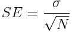
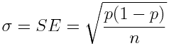

## Confidence Intervals

- How reliable are results? Knowing the accuracy on the test data, what is 'expectable' on out-of-sample data
- Confidence interval *[&mu; - z&sigma; ; &mu; + z&sigma;]*
  - Upper bound: &mu; + z&sigma;
  - Lower bound: &mu; - z&sigma;
  - Centred on: &mu;
  - With confidence level: z (3=99.7% ; 2.58=99% ; 2.33=98% ; 2=95%)
  - And standard deviation: &sigma;

### Central Limit Theorem
- Given/Assumed:
  - Large number of observations
  - Large random sample with n observations
  - Samples are *random* (independent from previous observations)
- Mean and sum of samples follows normal distribution
- The larger n, the closer the mean and sum of the sample get to true values
- Formulae:
  - Normal formulae for mean, variance, and standard deviation
  - Standard Error: 
  - Bessel's Correction: subtract 1 from N in st. dev and variance calculations
- Relevant Caveats for ML
  - &sigma; = SE (if true, the population is at least 20 times larger than sample)
  - p = Sample proportion = Performance (e.g. accuracy) on test set
  - **Expected classification accuracy: p &pm; SE:** 
