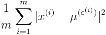
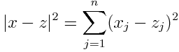
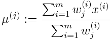
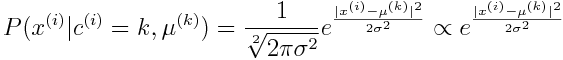
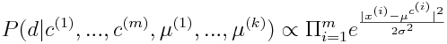
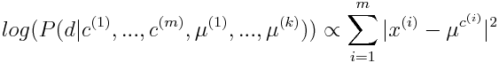
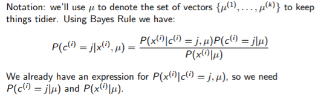
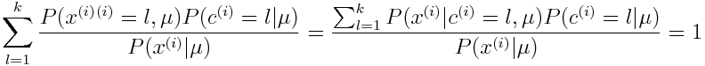
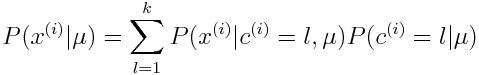
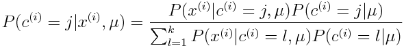

## Unsupervised learning

- **Supervised learning** - we know the target labels, training is trying to find the values which correlate to the given target
- **Unsupervised learning** - we don't know target labels, grouping instances by similarity
  - Applications: Google News, Fraud Detection, Market Segmentation, Social Network Analysis
  
### K-Means algorithm

- Inputs: 
  - Number of clusters, k (k must be less than the number of instances)
  - Training data (we do not use the x0 = 1 convention here.)
- Approach: randomly initialise k cluster centres (using k points from training)
- The algorithm:
  - Repeat {For every instance of training data, assign instance to nearest cluster ; For every cluster, update the centre to be the mean of the assigned instances} until the assignments remain consistent

##### Goal of K-Means optimisation
- Minimise the dispersion of the clusters
  - 

##### Shortcomings
- K-Means can get stuck on local optima and not reach the global optima
  - So use multiple random initialisations and choose the lowest cost clustering.
- We have to predefine K :thumbsdown: 
  - **'Elbow method':** vary k, pick value at 'elbow' (sudden kink in graph of cost vs k) - There may not be an elbow (or at least a clear one)
  - **Cross-validation:** randomly select subset of training data, run k means and calculate cost using test data, repeat for multiple random subsets and values of k.
  
##### Soft K-Means
- Our current K-means approach involves hard assignment
- **Soft Assignment:** - We can extend k-means to estimate the probability that x(i) is in class j
- Using a Gaussian Kernel:
  - 
  - Where we define the distance between vectors x and z as: 
  - Sigma defines the width of the bell shape
  
- **One Approach:** Change k-means so point x is associated with cluster j with weight K(x,\mu^{(j)})
  - New algorithm: Repeat {for every data instance: for every cluster: calculate the probabilistic belonging to the cluster (belonging to this cluster divided by sum of belonging to every cluster) ; update centres to weighted average} until centres stabilise
  - Centre update formula: 
  - Using a statistical model: given data has label k, the observation x(i) equals centre \mu^{(k)} plus some Gaussian noise (i.e. X = \mu_{j}^{(k)} + M where M ~ N(0,\sigma^{2}) so...
  -  where c(i) is the label of training point x(i)
  - Observations are independent, so likelihood of training data is 
  - take log of both sides: 
  - **So k-means is a log-likelihood maximisation problem**
  
##### Full Probabilistic Interpretation of K-Means

- 
- We already have an expression for P(x^{i}|c^{(i)}=j,\mu) so we need P(c^{(i)}=j|\mu) and P(x^{(i)}|\mu)
- **P(x^{(i)}|\mu)**:
  - Use fact that \sum_{l=1}^{k} P(c^{(i)}=l|x^{(i)},\mu) = 1 (its a probability)
  - That is... 
  - and so... 
  - Finally 
  
  - **So:** P(x(i)|c(i)=k,\mu(k)) is proportional to the Guassian
  - If we assume that the size of each cluster is the same (i.e. P(c(i)=j|\mu) = 1/k for all j = 1..k)
  - **Then we can say that P(c(i)=j|x(i),\mu) is equal to wj(i)**
