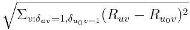
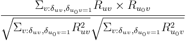
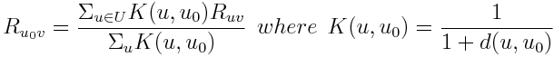
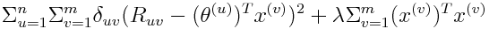
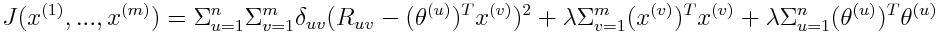
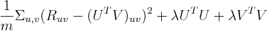

## Recommender Systems

#### Notation
- *n* is number of users
- *m* is number of items
- *d* is number of features
- *Ruv* is rating given by user *u* to item *v*
- *&delta;uv* = 1 if item *v* rated by user *u*, else = 0

#### Content-Based Recommendations
- Given a feature vector x(v) for the *v*'th item
- For each user, *u*, we learn a parameter vector, *&theta;(u)*
- Training data: set of ratings, {Ruv} by users of a subset of items **(each user might only rate a few items - generally sparse data)**
- **Hypothesis: predicted rating by user *u* of item *v* is:** h&theta;(u)(x(v)) = (&theta;(u))Tx(v)
- Cost Function: J(&theta;(1),...,&theta;(n)) = &Sigma;u=1n &sigma;v=1m&delta;uv(Ruv - (&theta;(u))Tx(v))2 + &lambda;&Sigma;u=1n(&theta;(u))T&theta;(u)
  - Select &theta; to minimise - solving least squares through gradient descent, or closed form.
  
#### User-Based Recommendations
- To predict rating Ruv of item *v* by user *u0* - use KNN approach
  - Find the k closest users to u0
  - Euclidean Distance d(u,u0) 
  - Cosine Distance d(u,u0) 
- Predicted Ru0v is weighted average of the rating of item v by these users
  - 
  
**Note: these data sets are generally extremely sparse, so both approaches would struggle**

#### Collaborative Filtering
- How we deal with not knowing the feature vectors
- Can find feature vectors for items using observed ratings knowing the user's preferences
- 
- Define a cost metric: 
  - Given [&theta;] we can select [x] to minimise J
  - Given [x] we can select [&theta;] to minimise J
- Requires least squares problem solving: gradient descent, or closed-form solution
- **Predicted Rating by user *u* on item *v* is: (&theta;(u))Tx(v)**

#### Collaborative Filtering using Matrix Completion
- Gather ratings into a matrix, and attempt to predict the missing entries in R.
- Assume R is low rank d << n,m
- Hypothesis: R=UTV, but the elements of U and V are unknown
- Cost function: 

#### Issues
- Data sparsity - particularly big issue for content/user-bassed methods:
  - Content-based: not enough ratings to estimate &theta;(u) for user u
  - User-based: or to find nearest neighbours with enough ratings
- Cold-start problem: how to recommend to a new user?
- Popularity bias: how to recommend to someone with unique tastes
  - Even with lots of data, hard to get model to generalise well
  - Intrinsic noise in recommenders e.g. Netflix people review between 3 and 5 only
- Shilling attacks/adversarial attacks - systems needed to prevent false reviews (proof of purchase/rep over time)
- Privacy - access control on data, adding noise, hiding in the crowd
