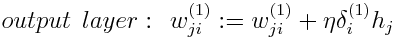

## Neural Networks

### Artificial Neural Nets
- Often used for Classification: Binary and multiclass
- Can also be used for: regression, unsupervised learning
- Similar to SVM

- Timeline: advanced in 60s, slowed in 70s, advances in 80s, slowed in 90s, advanced in 2000s

### Biological Neural Networks
- ~100 neurons in human body, each connected to ~1000 others, organized in layers
- Functional classes of neurons: stimulus (perceivers), afferent (pass inwards), efferent (pass outwards), response (doers)
- I/O is electrical voltage - output is decided by summing inputs, sending output if exceeds threshold
  - Dendrite to Axon connection: synapsis - can amplify (excitatory) or reduce (inhibitory) the signal strength

### Artificial Neural Networks Overview
- **5 Tribes of Machine Learning:**
  - *Tribe      | Origins           | Master Algorithm*
  - Symbolists | Logic, Philosophy | Inverse Deduction
  - Connectionists | Neuroscience  | Backpropagation
  - Evolutionaries | Evolutionary Biology | Genetic Programming
  - Bayesians | Statistics | Probabilistic Inference
  - Analogizers | Psychology | Kernel Machines
- There are many neuron types and many network types

### The McCulloch-Pitts Artificial Neuron - The first model of an artificial neuron
- 
  - Where xexc are the binary inputs, xinh are the inhibitory binary inputs, w is the weight for all excitatory inputs
  - z is the combination function (sum of weights by inputs), &phi; is the activation function, &theta; is the threshold, and y is the output
- OR neuron
  - 
  - where &phi; is: z &geq; &theta;
- AND neuron (with variations)
  - 
  - where &phi; is: z &geq &theta;
- Various other logical neurons
  - 
- XOR is a unique problem
  - 
  - Where z is the sum of the excitatory inputs times their weights, and &phi; is 1 if z &geq; &theta; AND xinh = 0
  
### The Rosenblatt Perceptron
#### Neuron/Linear Threshold Unit (LTU)
- 
- n variable inputs x1..n
- x are features not instances
  - We have one constant input x0 = 1 - **Bias Feature**
- n+1 weights w0..n
- One input y per LTU - but a network of LTUs may have multiple outputs, one per LTU
  - &phi;heaviside = h(z) = 0 or -1 if z < 0 else if z &geq; 0 then 1
  - &phi;sign = sgn(z) = -1 if z < 0, 0 if z = 0, 1 if z > 0
- Input and output are typically binary (but not necessarily)
- No special inhibitory input
- **Training goal: Learn w0..n**

#### Single Layer Perceptron
- One input layer, one output layer - input neurons just pass through the inputs
- Each neuron in layer lk is connected to each neuron in lk+1
- Example of a 2 input, 3 output - Multioutput Classifier 

### Perceptron Training
#### Hebb's rule/Hebbian Learning
- Initialize wi,j with small random numbers [-1,1]
- For each training instance:
  - Calculate the output with the current weights
  - Update weights if the prediction was wrong
  - wi,j = wi,j + &alpha;(yj - y'j)xi
- Continue until Convergence (for linearly separable classes)/Error Threshold/Fixed number of iterations

#### Decision boundary
- Models like SVM try to find the optimal decision boundary - a perceptron just finds *some* decision boundary
- Single layer perceptrons only learn linear decision boundaries
- Only can converge on linearly separable classes
- Poor performance generally and limited in what they can learn - noise can make data non-linearly separable
- **Good for online learning**

### MultiLayer Perceptrons
- One passthrough input layer, one or more hidden layers of LTUs, one output layer of LTUs
- Input layer **and** hidden layer include bias neuron
- 2 or more hidden layers = deep neural network
- With one hidden layer we can model any mathematical function

#### Activation functions
- Originally **Sigmoid/Logistic functions** used: &sigma;(z) = 1/(1+e-z) - most similar to biological neurons
- **Hyperbolic Tangent Function:** tanh(z) = (ez-e-z)/(ez+e-z)
- **Rectified Linear Unit function:** ReLU(z) = max(0,z) 
  - **Use for hidden layers - fast computation, gradient descent doesn't get stuck on plateaus**
- Softmax for output layer (if classes are mutually exclusive)
- There is no activation function used for regression

#### Intuition - SLP vs MLP
- Single Layer Perceptron 
- Multi Layer Perceptron 

#### Practical Issues
- Designing Neural Networks is an art, not a science
- Number of hidden layers
  - 0 (i.e. one layer of LTUs) -> linearly separable functions
  - 1 -> Any function for continuous mapping from one finite space to another
  - 2 -> Any decision boundary
- More Layers? Our model would move from abstract to complex
  - The less neurons the faster training - more neurons leads to longer training
  - Reduction in effectiveness of backpropagation/unstable gradient descent/more local minima
- Number of Neurons
- Number of input Neurons |Nx| = *Number of features*
- Number of output Neurons |Ny| = *Number of (dummy)classes (or 1)*
- Number of Hidden Neurons |Nhid|
  - Too many: overfitting & long training | Too few: underfitting
  - 
  - Where |D| is the number of instances in training data, and &alpha; [5..10] (arbitrarily selected scaling factor)

#### Feature Engineering
- With binary inputs - use -1 and 1 not 0 - better performance
- For categorical inputs, encode as dummy variables (-1 or 1)
- For categorical outputs, use softmax

### Training an MLP
#### Gradient
- Etotal&geq;0
- wj,i &in; R
- **Update rule for MLP:**
  - 
  - Challenge though - many w's in several layers, and there can be several points of error
- How can we find the optimal weights?

#### Forward Propagation
- Calculate outputs, and errors

#### Backpropagation
- How much does a change in wj,i affect the total cost function i.e. the total error
- Adjust weights in a way which minimises the cost
- The algorithm:
  - Present example *x* to the input layer and propagate it through the network.
  - Let y = (y1,...,ym) be the output vector, and let t(x) = (t1,...,tm) be the target vector
  - For each output neuron, calculate its responsibility, &delta;i(1), for the network error: &delta;i(1) = yi(1-yi)(ti-yi)
  - For each hidden neuron calculate its responsibility, &delta;j(2), for the network's error (using the output neurons responsibility): 
  - Update the weights using the following formulas, where &eta; is the learning rate:  Where hj is the output of the j-th hidden neuron  Where xk is the value of the k-th attribute
  - Repeat until termination criteria have been satisfied.
- Use delta rule for convenience.

#### Issues of Backpropagation
- Happens every epoch - very expensive
- The more layers, the less effective backpropagation becomes.

### The Role of TF-IDF (Term Frequency-Inverse Document Frequency) or ML

#### Document Clustering/Classification
- Typical ML workflow
  - Transform data, use with ML learning algorithm
  - Examples of data transformation: Encode Nationality as a dummy variable, ignore gender, normalize numbers
- How do we do this with documents?
  - Transform documents into data matrix..?
- **Document-Term Frequency Matrix**
  - In the Corpus *D* with *n* documents *di=1..n* and a vocabulary of *m* terms *tj=1..m*, each document *di* is represented as vector of term-document weights *di = {wi,1,...,wi,m}*
- How to find weights?
  - Boolean - most simple - boolean weights (doesn't capture the degree of true/false)
  - Term frequency(tf) - better - *wi,j = tf(di,tj)*
  - **TF-IDF - The best** - *wi,j = tfidf(di,tj,D)*

#### TF-IDF 
- More advanced weighting scheme
- 
  - Where n is the number of documents in the corpus, and |dtj| is the number of docs with term tj
  - Note: Log is base 10
