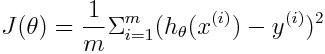

## This document contains the terms/formulae/stuff that I think could be asked in the exam.

## Sections
- [ML in Action](#ml-in-action)
- [Linear Regression](#linear-regression)

# ML in Action
- Data mining - The process of discovering patterns in large datasets
- Supervised Learning
  - Used for: Classification, Prediction/Regression
  - Takes in data with targets
  - Algorithms: KNN, SVM, Decision Trees & Random Forests
- Unsupervised Learning
  - Used for: Clustering, Dimensionality Reduction
  - Takes in: Unlabelled data
  - Alogrithms: K-Means, Hierarchical Cluster Analysis, Expected Maximization
- Semi-Supervised Learning
  - Mix of supervised and unsupervised - takes data with some labels, but mostly unlabelled
  - E.g. Google Photos - Cluster by data (faces), Target labels are sporadically assigned by the user
- Reinforcement Learning: agent observes environment, chooses action and is rewarded/penalised
- Batch/Offline Learning
  - Trained on all data - when new data is received, train on old and new - expensive
- Incremental/Online Learning
  - Trained only on new data as it becomes available - can dispose of data after training
- Model based learning 
  - Find a function which describes the existing instances
- Instance based learning
  - Find similar instances to new one, assume the values apply
- Parametric models
  - Based on features and weights e.g. linear regression
- Non-Parametric models
  - No fixed functional form, can grow in complexity to capture complicated problems
- Strengths of ML
  - Don't need large rule base, can solve complex problems, can deal with changing environment/data
- Weaknesses of ML
  - Need lots of data (not always available), can be a blackbox, legal implications, cannot unit test

# Linear Regression
- Fit a line to your data :dizzy_face:
- Hypothesis: h&theta;(x) = &theta;Tx
  - Where &theta; is a vector of parameter weights, and x is our data (incl. Dummy variable x0 = 1)
- Cost function: 
  - Calculates the average residual
- Minimisation done through gradient descent:
  - 
  - Where &alpha; is the learning rate, m is the size of the data set
- Normalization
  - 
- Batch Gradient Descent (BGD)
  - At each iteration, BGD uses all m training data, updates all n+1 parameters
- Co-ordinate Gradient Descent (CGD)
  - At each iteration update only one param
- Stochastic Gradient Descent (SGD)
  - Loop through training set, each time updating the parameters w.r.t a single instance
- **Closed Form Solution**
  - Find &theta; that minimises J(&theta;) in closed form
  - 
  - where y is the vector of targets, and X is matrix of data
- Regularization
  - Overfitting: adding more parameters, fitting to noise in dataset
  - Underfitting: poorly fitted data due to too few parameters
  - Quadratic/L2 penalty: &theta;T&theta; - encourages small values of theta - **Ridge**
  - L1 penalty: sum of absolute values of &theta; - encourages fewer elements of &theta; to be non-zero - **LASSO**
- Cross-validation for feature/model selection
  - Divide the data into chunks, and calculate &theta; for each, using it to tune the features/parameters
  - Can be used for Confidence intervals - 10 chunks = 10 samples in CI formula, take mean accuracy
