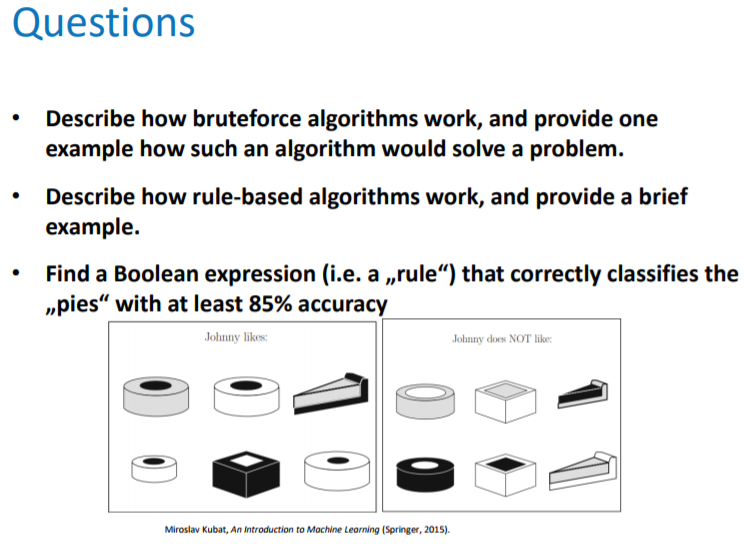
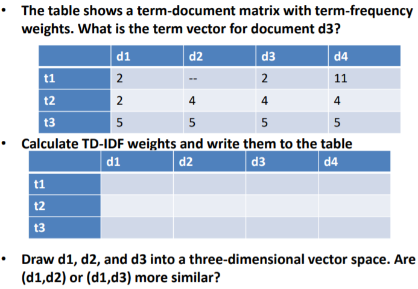
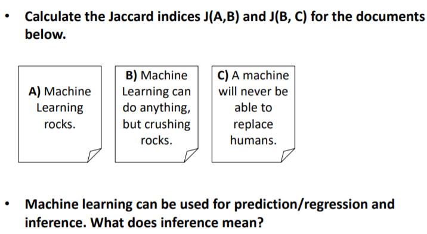
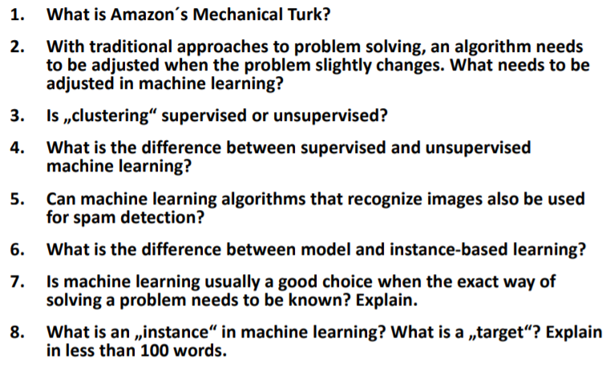
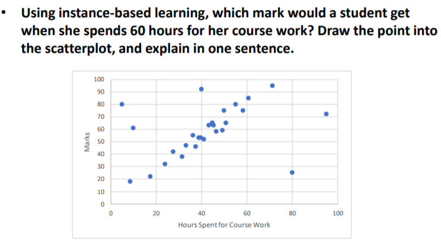

# Machine Learning Study Materials

## Questions by topic

- [Introduction](#introduction)
  * [Question Set 1](#t1q1)
  * [Question Set 2](#t1q2)
  * [Question Set 3](#t1q3)    
  * [Question Set 4](#t1q4)
  * [Question Set 5](#t1q5)
  
### Introduction

Questions on introductory topics to Machine Learning.

[Back to top](#questions-by-topic)
